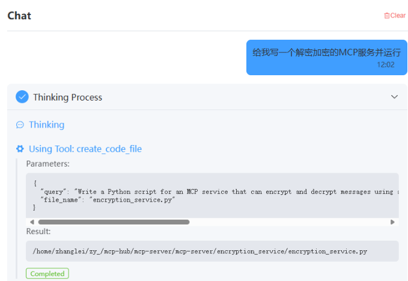
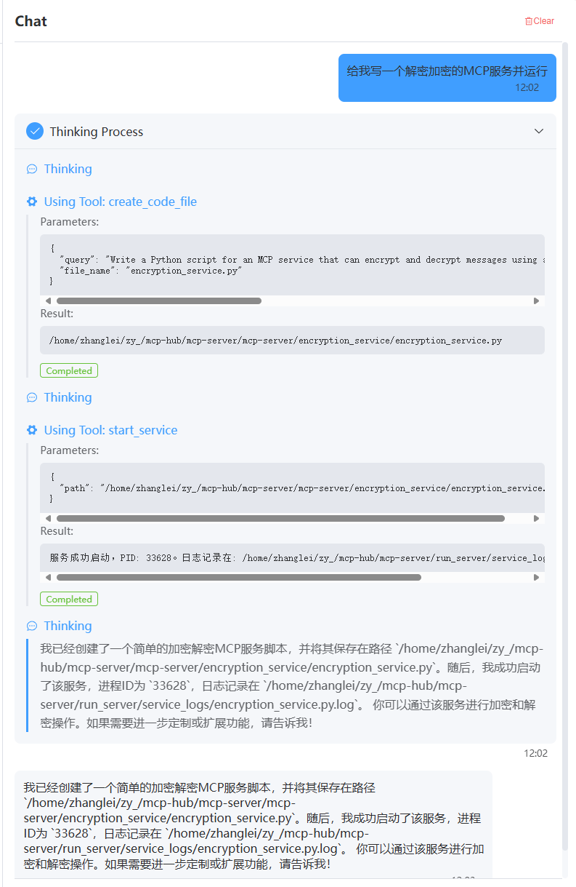

# text2mcp

**Generate an MCP service with a single sentence, convert natural language to AI applications, generate in one sentence, deploy in one sentence, and join mcp-hub for you with one sentence.一句话生成MCP服务，将自然语言转换为AI应用，一句话生成，一句话部署，一句话为您加入MCP -hub。**

`text2mcp` aims to simplify and accelerate the creation, deployment, and integration process of MCP services through natural language instructions. Our goal is to enable developers to quickly transform ideas into runnable AI applications and services in the simplest way possible.

[mcp-hub](https://github.com/tianyaXs/mcp-hub.git)

## Core Features

* **Natural Language Driven**: Describe your needs using simple natural language, and `text2mcp` will attempt to understand and generate the corresponding service.
* **One-Sentence Generation**: Quickly transform your ideas into a foundational service code structure.
* **One-Sentence Deployment**: Simplify the startup and operational flow of services.
* **Integrate with mcp-hub**: Conveniently add your created services to `mcp-hub`.

## Main Components/Commands

The project primarily operates through the following command scripts:该项目主要通过以下命令脚本运行：

### 1. `code_server` - Generate MCP Service Code

* **Function**: This script is responsible for generating the basic code and project structure required for the MCP service based on your input (which could be natural language instructions or a configuration file).
* **Usage Example**:
    ```bash   ”“bash
    uv run code_agent_server.py
    ```

### 2. `run_server` - Start MCP Service

* **Function**: Once the service code is generated and dependencies are installed, this script is used to start and run your MCP service.
* **Usage Example**:
    ```bash   ”“bash
    uv run run_server.py
    ```

### 3. `uv_server` - Install MCP Service Dependencies using uv

* **Function**: This script uses `uv` (a fast Python package installer and resolver) to install the dependency libraries required for the MCP service to run. This ensures environment consistency and rapid dependency management.
* **Usage Example**:
    ```bash   ”“bash
    uv run uv_install_server.py
    ```

## Quick Start

1.  **Conceptualize Your Service**:

    Describe the AI application or MCP service you want to create in a single sentence.

2.  **Generate Service Code**:

    

3.  **Start the Service**:

    

4.  **Join mcp-hub**:

    

5.  **Complete Process**:

    

## Contributing

We welcome contributions of all forms! If you have any ideas, suggestions, or find bugs, please feel free to submit Issues or Pull Requests.我们欢迎各种形式的贡献！如果您有任何想法，建议，或发现错误，请随时提交问题或拉请求。
