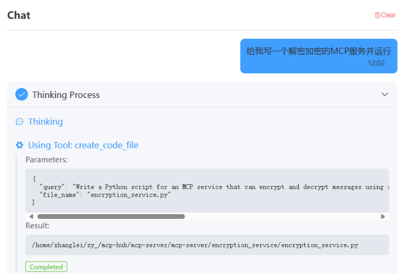
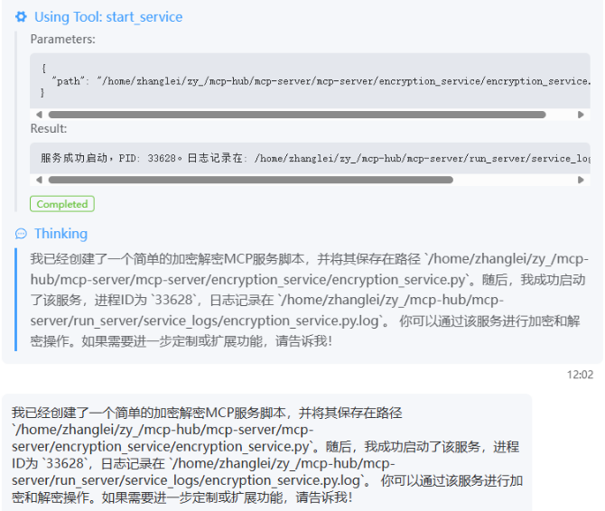
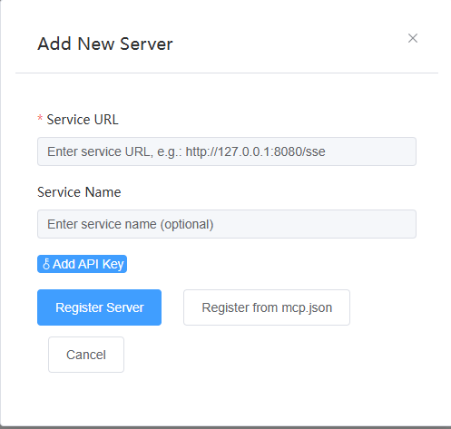
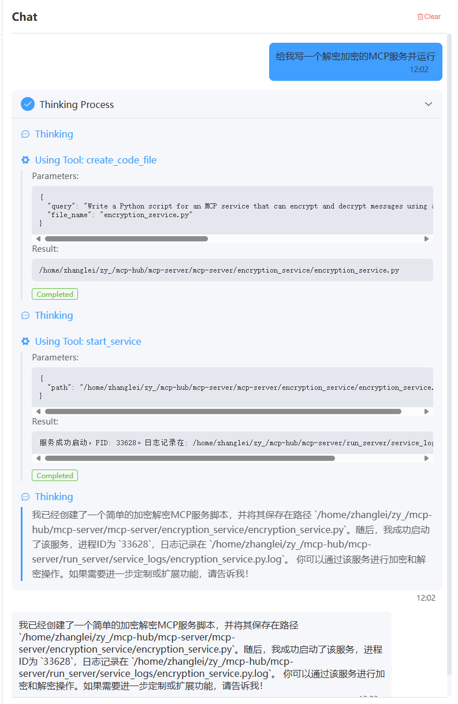

# text2mcp

**一句话生成一个MCP服务，自然语言与AI应用的转换，一句话生成，一句话部署，一句话为你加入mcp-hub。**

`text2mcp` 旨在通过自然语言指令，简化和加速 MCP 服务的创建、部署和集成流程。我们的目标是让开发者能够用最简单的方式，将想法快速转化为可运行的AI应用和服务。

[mcp-hub](https://github.com/tianyaXs/mcp-hub.git)

## 核心功能

* **自然语言驱动**: 使用简单的自然语言描述您的需求，`text2mcp` 将尝试理解并生成相应服务。
* **一句话生成**: 快速将您的想法转化为基础的服务代码结构。
* **一句话部署**: 简化服务的启动和运行流程。
* **集成mcp-hub**: 方便地将您创建的服务加入到 `mcp-hub` 

## 主要组件/命令

项目主要通过以下命令脚本进行操作：

### 1. `code_server` - 代码生成MCP服务

* **作用**: 此脚本负责根据您的输入（可能是自然语言指令或配置文件）生成MCP服务所需的基础代码和项目结构。
* **使用示例 (假设)**:

    ```bash
    uv run  code_agent_server.py
    ```

### 2. `run_server` - 服务启动MCP服务

* **作用**: 当服务代码生成完毕并且依赖安装完成后，此脚本用于启动和运行您的MCP服务。
* **使用示例**:

    ```bash
    uv run run_server.py
    ```

### 3. `uv_server` - uv依赖安装MCP服务

* **作用**: 此脚本使用 `uv` (一个快速的 Python 包安装器和解析器) 来安装MCP服务运行所需的依赖库。这可以确保环境的一致性和快速的依赖管理。
* **使用示例 (假设)**:

    ```bash
    uv run uv_install_server.py

## 快速开始

1.  **构思您的服务**: 
    用一句话描述您想要创建的AI应用或MCP服务。
2.  **生成服务代码**:
   
3.  **启动服务**:
    
4.  **加入 mcp-hub**: 
    
5.  **完整过程**:
    

## 贡献

我们欢迎任何形式的贡献！如果您有任何想法、建议或发现bug，请随时提交 Issues 或 Pull Requests。

